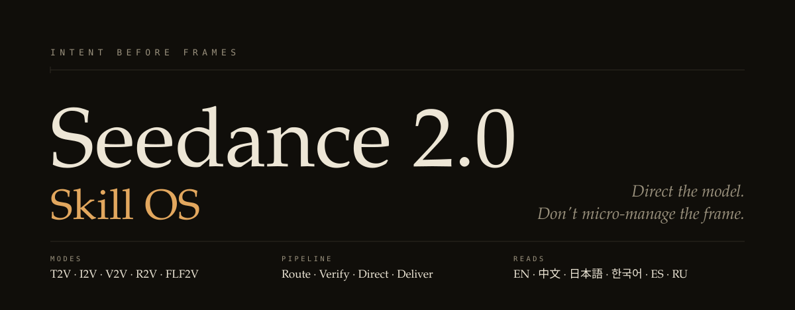
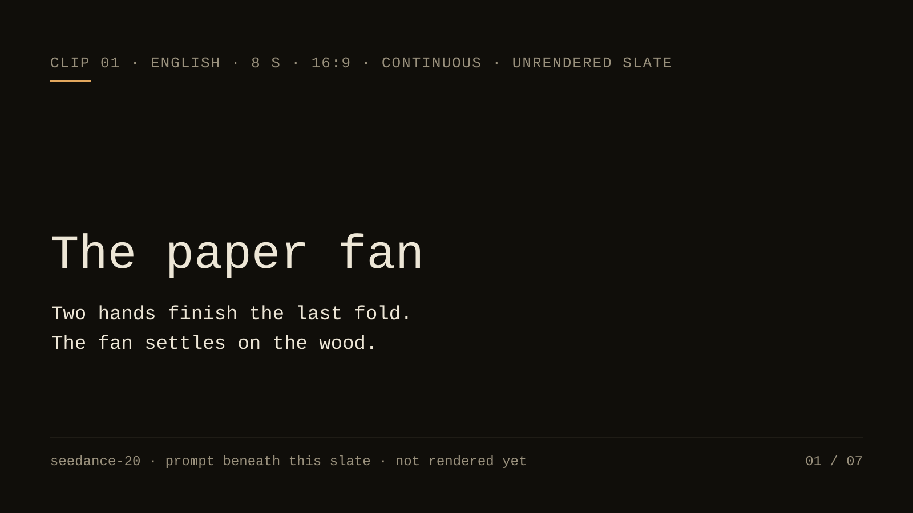
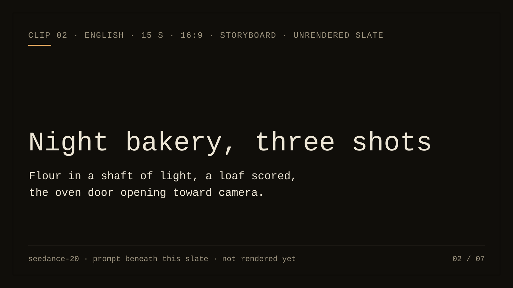
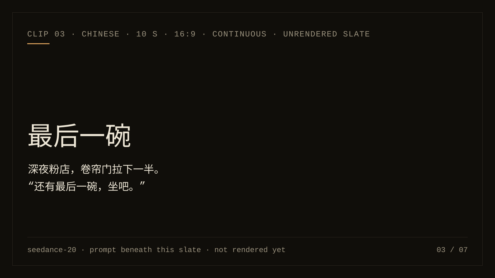
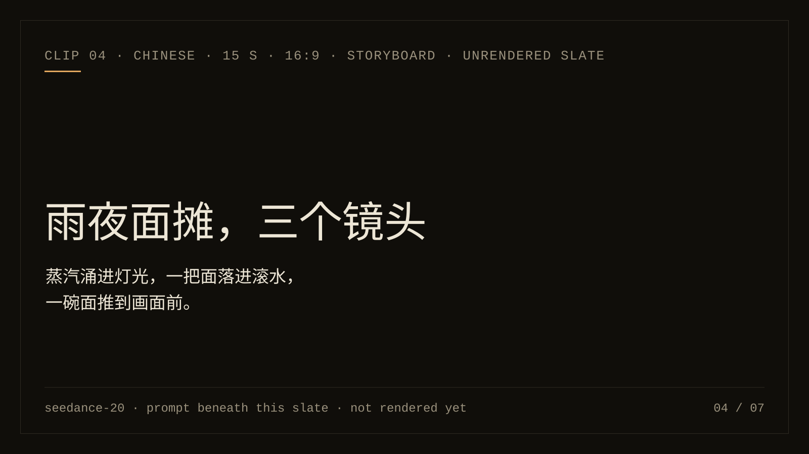
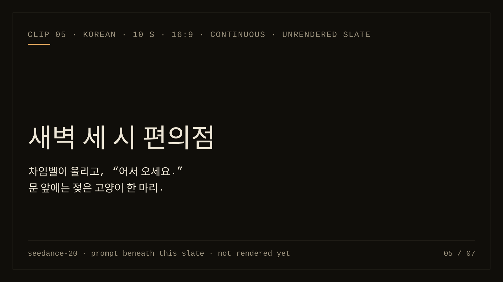
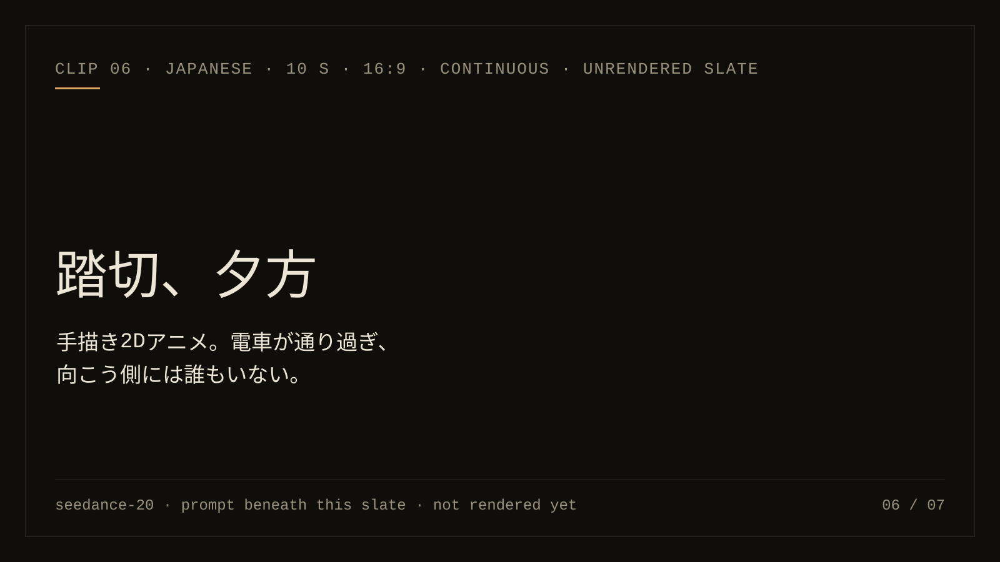
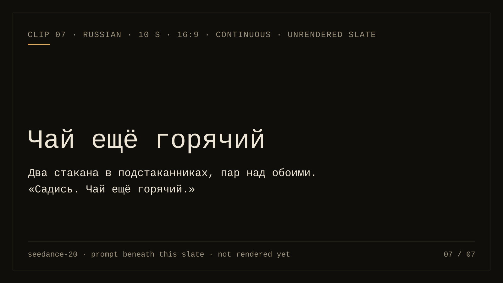
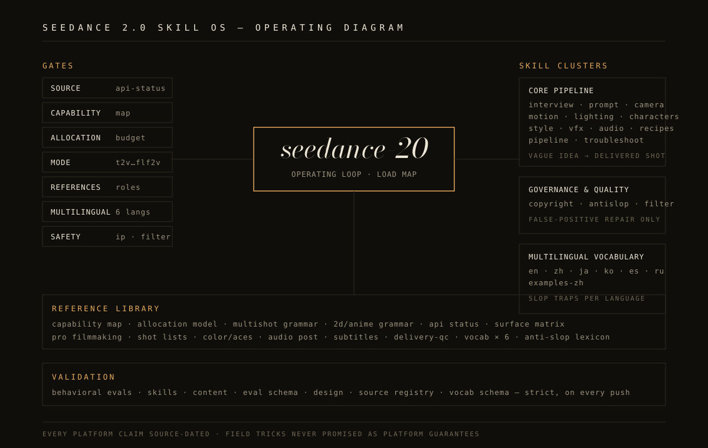

<picture>
  <source media="(prefers-color-scheme: dark)" srcset="assets/hero-dark.svg">
  <source media="(prefers-color-scheme: light)" srcset="assets/hero-light.svg">
  
</picture>

**Turn an idea into a directed video prompt.** Seedance 2.0 Skill OS is an agent
skill for planning shots, binding references and continuing from an accepted
clip. Your video provider handles generation and its costs.

[Watch the clips](#seen-not-told) · [Try a first prompt](#start-here) · [Install](#install) · [Choose a workflow](#choose-a-workflow) · [Evidence status](#evidence-status)

`v6.7.0` · [MIT](LICENSE) · [Changelog](CHANGELOG.md) · [Emily / Iamemily2050](https://github.com/Emily2040)

**Languages:** English (this page) · [中文](docs/README.zh.md) · [日本語](docs/README.ja.md) · [한국어](docs/README.ko.md) · [Español](docs/README.es.md) · [Русский](docs/README.ru.md)

Five-minute quickstarts: [English](docs/QUICKSTART.md) · [中文](docs/QUICKSTART.zh.md) · [日本語](docs/QUICKSTART.ja.md) · [한국어](docs/QUICKSTART.ko.md) · [Español](docs/QUICKSTART.es.md) · [Русский](docs/QUICKSTART.ru.md)

## Seen, not told

Seven clips, seven prompts, five languages. Each clip is generated on Seedance 2.0 from the exact prompt beneath it: text to video, no reference assets, one take, no post work. Above each prompt sits the kind of brief people usually type, so the difference is visible before it is explained. Where a clip has not been rendered yet, its slate stands in its place.

<table>
<tr>
<td width="50%" valign="top"><a href="#clip-01-the-paper-fan"></a></td>
<td width="50%" valign="top"><a href="#clip-02-night-bakery-three-shots"></a></td>
</tr>
<tr>
<td width="50%" valign="top"><a href="#clip-03-最后一碗"></a></td>
<td width="50%" valign="top"><a href="#clip-04-雨夜面摊三个镜头"></a></td>
</tr>
<tr>
<td width="50%" valign="top"><a href="#clip-05-새벽-세-시-편의점"></a></td>
<td width="50%" valign="top"><a href="#clip-06-踏切夕方"></a></td>
</tr>
<tr>
<td width="50%" valign="top"><a href="#clip-07-чай-ещё-горячий"></a></td>
<td width="50%" valign="top"></td>
</tr>
</table>

#### Clip 01: The paper fan

<sub>English · 8 s · 16:9 · continuous · slate: not rendered yet</sub>

**What people usually type:** *cinematic close up of hands folding a paper fan, warm lighting, 4k, ASMR*

<details>
<summary>The prompt the skill wrote</summary>

> Locked tabletop shot. Two hands finish the last fold of a paper fan and let go. The fan settles on the wood. Hold still for one beat. Warm desk-lamp light; dry paper rustle and room tone. No music.

</details>

#### Clip 02: Night bakery, three shots

<sub>English · 15 s · 16:9 · storyboard · slate: not rendered yet · ladder: Safe: 3 beats, load 1.5, S = 3.3</sub>

**What people usually type:** *artisan bakery b-roll, bread being scored, cinematic warm light, slow motion, multiple shots*

<details>
<summary>The prompt the skill wrote</summary>

> Shot 1. Locked close-up inside a dark bakery before dawn: one bare bulb throws a shaft of light
> across a floured wooden bench, and flour dust drifts through the beam. Shot 2. Cut to a medium
> shot at bench height: a baker's hands score a proofed loaf with a razor blade in one clean
> curve, the cut opening as the blade passes, a little flour lifting off the knuckles. Shot 3. Cut
> to the oven door swinging open toward camera, then a slow push-in through the heat shimmer until
> the loaf's dark crust fills the frame; hold there. Warm tungsten light only; the rest of the
> room falls to black. Sound: the blade through dough, the oven door's hinge, a low burner roar.
> No music, no subtitles.

</details>

#### Clip 03: 最后一碗

<sub>中文 · 10 s · 16:9 · continuous · slate: not rendered yet</sub>

**What people usually type:** *深夜小店老板娘温暖治愈的一幕，电影感，氛围感，8K*

<details>
<summary>The prompt the skill wrote</summary>

> 固定中景，镜头与柜台同高。深夜的小粉店，卷帘门已经拉下一半，柜台上只剩一盏灯。老板娘（五十多岁，围裙，袖口挽起）正把抹布叠好，手停在半空，抬眼看向门口，把一副早就摆好的筷子往前推了推。老板娘平静地说：“还有最后一碗，坐吧。”说完低头继续擦柜台，嘴角不动。灯光只有柜台上方那一盏暖光灯，门外是冷色的路灯。声音：风扇的嗡嗡声，汤锅轻微的咕嘟声，说话时其他声音压低；无配乐。保持无字幕。

</details>

#### Clip 04: 雨夜面摊，三个镜头

<sub>中文 · 15 s · 16:9 · storyboard · slate: not rendered yet · ladder: Safe: 3 beats, load 2, S = 3.0</sub>

**What people usually type:** *雨夜面摊，烟火气，运镜丝滑，多个镜头，大片感*

<details>
<summary>The prompt the skill wrote</summary>

> 镜头1：固定特写，雨夜路边面摊，大锅上的蒸汽涌进头顶那盏白炽灯的光里，雨丝在光里划过，锅沿挂着水珠。镜头2：镜头切至摊主的中景，摊主（六十岁左右的男人，白背心，毛巾搭肩）抓起一把面甩开、抖散，落进滚水里，水面翻起一圈白沫，他随手盖上锅盖。镜头3：镜头切至柜面的低角度，一碗浇了葱花和辣油的面被推到画面前方，一只湿漉漉的手接过碗，碗停在画面中央，蒸汽继续往上冒。全片只有摊头这一盏灯，背景是雨里模糊的车灯。声音：雨声、油锅和滚水的声音、碗底在木板上划过的声音；无配乐，保持无字幕。时长：15秒。

</details>

#### Clip 05: 새벽 세 시 편의점

<sub>한국어 · 10 s · 16:9 · continuous · slate: not rendered yet</sub>

**What people usually type:** *새벽 편의점 알바생 감성 영상, 시네마틱, 비 오는 날, 고양이*

<details>
<summary>The prompt the skill wrote</summary>

> 카메라는 계산대 높이에 고정된 미디엄 숏. 새벽 세 시의 편의점, 창밖에는 비가 내리고 냉장고 불빛이 통로를 비춘다. 야간 아르바이트생(이십 대 여성, 조끼 유니폼, 머리를 대충 묶음)이 계산대 뒤에서 컵라면 진열을 정리하고 있다. 출입문 차임벨이 울리고, 그녀는 고개를 들지 않은 채 습관처럼 말한다. 아르바이트생: “어서 오세요.” 대답이 없자 고개를 들어 문 쪽을 본다. 문 앞 매트 위에 젖은 고양이 한 마리가 앉아 그녀를 올려다보고 있다. 그녀는 아무 말 없이 반쯤 웃은 얼굴로 멈추고, 카메라는 그 표정에서 끝난다. 조명은 편의점 형광등과 창밖의 파란 새벽빛뿐. 소리: 차임벨, 유리창을 때리는 빗소리, 냉장고의 낮은 웅웅거림, 대사 중에는 다른 소리를 낮춘다. 음악 없음, 자막 없음.

</details>

#### Clip 06: 踏切、夕方

<sub>日本語 · 10 s · 16:9 · continuous · slate: not rendered yet</sub>

**What people usually type:** *夏の夕方、踏切で電車を待つ少女、エモいアニメ風、有名スタジオっぽく*

<details>
<summary>The prompt the skill wrote</summary>

> 手描きの2Dセルアニメーション。セル画で描かれた人物を、水彩で塗られた背景の上に置く。1990年代のテレビアニメ調で、フィルムの粒子がわずかに乗った質感、限られた色数。夕方の住宅地の踏切。麦わら帽子をかぶった少女（十代前半、白いワンピース、片手に金魚の入った袋）が遮断機の前で立ち止まる。警報機が鳴り、電車が画面を横切る。車窓の光が少女の顔に描かれた縞になって明滅し、髪とワンピースの裾が風で遅れて揺れ、電車が抜けた後もひと呼吸だけ揺れが残る。踏切の向こう側には誰もいない。少女は小さく息を吐き、そのまま止め絵になる。カメラは背景の絵に対して固定。動きは基本二コマ打ち、電車の通過だけ背景のスクロールとスピード線で見せる。光は描かれた二段階のセル影、電車の窓明かりは顔の上の白い帯として描く。音：踏切の警報音、電車の通過音、通り過ぎたあとは蝉の声だけが残る。音楽なし、字幕なし。

</details>

#### Clip 07: Чай ещё горячий

<sub>Русский · 10 s · 16:9 · continuous · slate: not rendered yet</sub>

**What people usually type:** *уютная кухня, дедушка пьёт чай, кинематографично, атмосферно, 4k*

<details>
<summary>The prompt the skill wrote</summary>

> Статичный средний план на уровне стола. Зимний вечер, маленькая кухня в старой квартире: за
> окном синие сумерки и снег, горит только лампа над столом. Пожилой мужчина (за шестьдесят,
> вязаный жилет, очки сдвинуты на лоб) сидит боком к камере и режет хлеб. На столе два стакана чая
> в металлических подстаканниках, над обоими пар. Не поднимая глаз, он двигает второй стакан к
> пустому стулу на краю кадра и говорит ровно, почти буднично. Мужчина: «Садись. Чай ещё горячий.»
> Потом возвращается к хлебу, и только рука на мгновение задерживается на стакане. Свет: тёплая
> лампа над столом и холодный свет из окна. Звук: тиканье кухонных часов, нож по доске, тихий стук
> стакана о клеёнку; во время реплики остальные звуки тише. Без музыки, без субтитров.

</details>

How the clips are made, the settings, the internal read behind each prompt and the render record are in the [front-page clip brief](https://github.com/Emily2040/seedance-2.0/blob/main/docs/FRONT_PAGE_CLIPS.md). A rendered clip proves that one take; it is not a promise about the next one.

## Start Here

After installation, tell your agent what happens and what must stay fixed:

> Use seedance-20. A person finishes a paper fan at a workbench. Keep it quiet,
> with one static shot and no music. Give me the prompt only.

One possible draft:

```text
Locked tabletop shot. Two hands
finish the last fold of a paper
fan and let go. The fan settles
on the wood. Hold still for one
beat. Warm desk-lamp light;
dry paper rustle and room tone.
No music.
```

This is the prompt behind clip 01 in the gallery above. **Why these choices:** one visible action, a clear endpoint, a fixed camera and
an explicit sound choice. Duration and aspect ratio belong in your provider's
controls when that surface owns them. This is an unrendered teaching example;
it does not establish successful folding, motion or audio generation.

For another treatment, choose calm observation, a playful gag or a step-by-step
demonstration. Tell the agent which one you want to keep. A draft can be revised
without submitting a paid generation request.

<!-- teaching-image:placement -->
<!-- installed-readme-gallery:start -->


*AI-generated teaching concept, not Seedance output.* The still illustrates
material, framing and light; it does not prove the action or sound will render.
[Image provenance and prompts](docs/PAPER_FAN_ART.md).

<!-- installed-readme-gallery:end -->

More examples: [performance and dialogue](references/performance-example-cards.md),
[product and process](references/product-example-cards.md),
[reference and continuity](references/continuity-example-cards.md).

## Choose a workflow

| What you have | What to provide next |
|---|---|
| A rough idea | The action, feeling and delivery format; ask for a few distinct choices. |
| A prompt to improve | The draft and constraints you want preserved. |
| Image, video or audio references | Actual files and the role each should control. |
| An accepted clip to continue | Its observed ending and the next action. |
| A result that missed | The failed requirement and your remaining revision budget. |

Start with the [quickstart](docs/QUICKSTART.md),
[reference workflow](references/reference-workflow.md),
[continuation guide](skills/seedance-continuation/SKILL.md) or
[retake protocol](references/retake-protocol.md).

## Install

Get a local copy, then run the installer from that folder. This example selects
Codex user scope; other clients are in the table below.

```bash
git clone https://github.com/Emily2040/seedance-2.0.git
cd seedance-2.0
python scripts/install_codex_skill.py --client codex --scope user
```

Download ZIP also works: extract it and run the installer inside that folder.
Restart your client, then select `seedance-20`. Review the
[security policy](SECURITY.md) before configuring optional provider tools.
Prompt preparation does not authorize paid generation.

Treat the table below as common local targets to verify in your own client, not a universal support guarantee.

| Platform | Typical install target (verify in your client) |
|---|---|
| Claude Code | `~/.claude/skills/seedance-20/` (personal) or `.claude/skills/seedance-20/` (project) — both via `scripts/install_codex_skill.py --dest` |
| Codex | project `.agents/skills/seedance-20/` or user `~/.agents/skills/seedance-20/`; no-option installer keeps its historical path |
| Google Antigravity | `.agents/skills/seedance-20/` (workspace) or `~/.gemini/config/skills/seedance-20/` (global across Antigravity products) |
| OpenClaw | workspace `skills/seedance-20/` or `~/.openclaw/skills/seedance-20/` via `openclaw skills install` (ClawHub-compatible; skills already carry `openclaw:` metadata) |
| Hermes Agent | `~/.hermes/skills/seedance-20/` (primary); a project `skills/seedance-20/` directory is discovered only after its parent is added to `skills.external_dirs` in `~/.hermes/config.yaml` |
| Gemini CLI-style workspace | `.gemini/skills/seedance-20/` |
| GitHub Copilot workspace | `.github/skills/seedance-20/` |
| Cursor workspace | `.cursor/skills/seedance-20/` |
| Windsurf workspace | `.windsurf/skills/seedance-20/` |
| Trae (ByteDance) | `.trae/skills/seedance-20/` |
| Qwen Code (Alibaba) | `.qwen/skills/seedance-20/` or `~/.qwen/skills/seedance-20/` |
| OpenCode | `.opencode/skills/seedance-20/` (also reads `.claude/skills/` and `.agents/skills/`) |
| Amp (Sourcegraph) | `.agents/skills/seedance-20/` or `~/.config/agents/skills/seedance-20/` |
| Goose (Block) | `.agents/skills/seedance-20/` (also `.goose/skills/seedance-20/`) |
| Junie (JetBrains) | `.junie/skills/seedance-20/` or `~/.junie/skills/seedance-20/` |

Several of these clients share the `.agents/skills/` convention — Codex, Google Antigravity, OpenCode, Amp, and Goose all read it — so one install under `.agents/skills/seedance-20/` can serve them together, and `.claude/skills/` is read by many as a compatibility path. Install once as the `seedance-20` root skill; its sub-skills and references resolve by relative path.

<details>
<summary>Installation by client, replacement and recovery details</summary>

Client support for Agent Skills is still tool-specific. See [observed compatibility and the host smoke protocol](https://github.com/Emily2040/seedance-2.0/blob/main/docs/HOST_COMPATIBILITY.md) for tested revisions and explicit gaps. Codex documents a skill as a directory with a required `SKILL.md`, optional `scripts/`, `references/`, `assets/`, and optional `agents/` metadata.

Codex scans `.agents/skills` locations from the working directory upward, plus user/admin/system skill locations. A repository root with `SKILL.md` is shaped like a skill folder, but it still needs to be installed/copied under a scanned skills directory or distributed as a plugin for automatic discovery.

### Step 1 — get the files

Every install path below runs from inside a local copy of this repository, so start here:

```bash
git clone https://github.com/Emily2040/seedance-2.0.git
cd seedance-2.0
```

Without `git` installed, use the green **Code → Download ZIP** button on the repository page, unzip it, and change into the unzipped folder instead. Nothing else on this page works until one of those two has happened.

### Step 2 — install it into your client

The installer is not Codex-only. Choose a client and scope below, or point `--dest` at another client's documented skills parent directory:

```bash
# Codex — user scope at ~/.agents/skills
python scripts/install_codex_skill.py --client codex --scope user

# Claude Code — personal install at ~/.claude/skills
python scripts/install_codex_skill.py --client claude-code --scope user

# One existing project, outside this source checkout
python scripts/install_codex_skill.py --client codex --scope project --project-root /path/to/project

# Any other client — use its documented skills parent directory
python scripts/install_codex_skill.py --dest /path/to/client/skills
```

Choose either `--dest` or `--client` with `--scope`; project scope requires an
existing `--project-root` and never guesses from your current directory. The
[scope guide](https://github.com/Emily2040/seedance-2.0/blob/main/docs/INSTALL_SCOPES.md)
explains the paths. No-option commands preserve the historical
`$CODEX_HOME/skills` or `~/.codex/skills` default for existing workflows; they do
not migrate old copies. Use the same destination options with the read-only
`install_doctor.py` before deciding on replacement.

The command stages and validates the repository before promoting it to
`<dest>/seedance-20`, then prints where it landed. Concurrent installers
sharing that destination are serialized. Add `--force` only to replace a
complete existing install; the previous copy remains available for rollback
until the validated stage is promoted. The durability, recovery and same-account
trust boundaries of that transaction are documented in
[installer internals](https://github.com/Emily2040/seedance-2.0/blob/main/docs/INSTALL_INTERNALS.md).
Restart your client afterwards so `seedance-20` appears in its skill list.

Installs skip the quarantined `references/migrated/` history, the image gallery (about 18 MB of PNGs), the test suite, and the network-capable evaluator. The installer replaces the omitted gallery embeds with one repository link, so the installed README does not contain broken local asset targets.

A destination inside this repository is refused rather than attempted because it would mutate the source authority domain while the payload is being authenticated. For a project-local install, run the script from the project you are installing into, by absolute path, as above.

For a client that imports a local skill folder, first prepare the filtered payload in a new staging directory outside this checkout:

```bash
python scripts/install_codex_skill.py --dest /absolute/path/to/new-staging/skills
```

Import the resulting `skills/seedance-20/` folder, or run the installer with
`--dest` set directly to the skills parent directory your client scans. Keep the
directory name `seedance-20` and its relative layout. A raw repository clone or
a client-managed GitHub import may include the evaluator, provider helpers, tests
and archives; it does not carry the installer's filtered-payload guarantee.
Inspect how that client packages files before using a direct import. See
[manual transfer and verification](https://github.com/Emily2040/seedance-2.0/blob/main/docs/MANUAL_INSTALL.md).

</details>

## Evidence status

- Repository checks cover routing, state, packaging, source integrity and
  declared document structure. Passing them is not a rendered-quality verdict.
- Live model scores and rendered-pilot results remain pending. The
  [comparison protocol](https://github.com/Emily2040/seedance-2.0/blob/main/references/outcome-comparison.md)
  and [48-attempt pilot plan](https://github.com/Emily2040/seedance-2.0/blob/main/evals/capped-rendered-pilot.md)
  describe how to collect evidence without inventing results.
- Six languages have full pages, quickstarts and vocabulary. Independent
  review is pending for all of them, and the
  [coverage contract](docs/LANGUAGE_COVERAGE.md) currently flags every
  language for review after recent edits. Availability is not parity.
- Provider capabilities are surface-specific and dated. Check the
  [surface matrix](references/platform-surface-matrix.md) before choosing controls.

## What it routes

Describe the situation; the root skill loads what that situation needs.

<details>
<summary>The common cases, and what each returns</summary>

| You say | It loads | You get |
|---|---|---|
| “I have a vague idea.” | [`seedance-interview-short`](skills/seedance-interview-short/SKILL.md) | A brief and a first draft, or one blocking question. |
| “I know the scene I want.” | [`seedance-prompt`](skills/seedance-prompt/SKILL.md) | A production-ready prompt. |
| “Make it short and strong.” | [`seedance-prompt-short`](skills/seedance-prompt-short/SKILL.md) | A compressed 30–100 word prompt. |
| “This is a longer story.” | [`seedance-sequence`](skills/seedance-sequence/SKILL.md) | Story spine, continuity bible, sequence map, and the Clip 01 contract and prompt. |
| “Continue this video.” | [`seedance-continuation`](skills/seedance-continuation/SKILL.md) | A continuation from accepted footage, or a request for the missing clip or final frame. |
| “I have image, video or audio references.” | [`reference-workflow`](references/reference-workflow.md) | A role map for every asset and what each must not transfer. |
| “Use this as first frame and that as last.” | [`first-last-frame-guide`](references/first-last-frame-guide.md) | A continuous transition with endpoint locks. |
| “Make it feel directed, not just cinematic.” | [`directing-engine`](references/directing-engine.md) | One intention per scene and a coherent camera, light, blocking, performance and sound setup. |
| “The take is 80% right.” | [`retake-protocol`](references/retake-protocol.md) | A triage verdict, a one-variable retake, and an attempt budget. |
| “It failed or looks bad.” | [`seedance-troubleshoot`](skills/seedance-troubleshoot/SKILL.md) | A root-cause diagnosis and a repaired prompt. |
| “This uses a character, brand or real person.” | [`seedance-copyright`](skills/seedance-copyright/SKILL.md) | A safer rewrite that keeps the creative function. |
| “I need this for a client, campaign or delivery.” | [`pro-filmmaking-standards`](references/pro-filmmaking-standards.md) | The production object the role needs, then the prompt that fits inside it. |
| “API, pricing, model ID, provider?” | [`api-workflow`](references/api-workflow.md) | A source-gated operational checklist. |

</details>



The diagram is the contract: every request passes the gates, the root routes it,
and the validators hold the line. The complete map of 28 sub-skills and every
reference is in the [reference index](https://github.com/Emily2040/seedance-2.0/blob/main/docs/REFERENCE_INDEX.md);
the runtime authority is the load map in [`SKILL.md`](SKILL.md).

## Longer than one generation

Do not ask the skill to extend the original prompt. A continuation is based on
accepted generated footage, because Seedance may not end where the plan expected.

1. Describe the complete idea and how it ends.
2. The skill divides it into connected clips.
3. Generate Clip 01.
4. Return the generated clip or its final frame.
5. The skill records what actually happened.
6. It writes Clip 02 from the real ending.
7. Repeat until the planned final outcome is reached.

The project state is the source of truth, the clip contract is the current task,
and the prompt is compiled for that task only.

## Model line and platform facts

**This is a Seedance 2.0 skill.** ByteDance's
[official Seedance 2.5 model page](https://seed.bytedance.com/en/seedance2_5)
confirms a separate newer line, and
[Dreamina's official product page](https://dreamina.capcut.com/seedance/seedance-2-5)
says it is live on Dreamina.
Neither primary page gives an exact launch date, and API or other-surface availability was unconfirmed in the 2026-08-01 review.
The 2026-09-07 source review adds that Runway's API catalog now lists
`seedance2_5` separately, which does not establish account entitlement. Every
platform number in this repository is a 2.0 number. Establish which line a
surface runs before quoting one.

Before any factual claim about API availability, upload limits, pricing,
regions or model names, load [`api-status.md`](references/api-status.md) and
check its `last_verified` date. Treat every endpoint, model ID, price,
account requirement, face or reference policy, and output-rights claim as
provider-specific and recheck it live before implementation.

## Validation

<!-- installed-readme-validation:start -->

The validation toolchain supports **CPython 3.11 through 3.13**. CI exercises
both endpoints on Ubuntu and Windows; intermediate CPython 3.12 releases remain
inside the supported range. Python 3.10 and 3.14 are outside this lock's
supported range.

Install the two hash-pinned toolchains once, then run the release suite. The
offline source-metadata check runs with `--enforce-freshness` here so an old
checked-in registry stamp blocks a release; per-pull-request CI omits that flag
because metadata age depends on the calendar, not on the change under test.

```bash
python -m pip install --require-hashes --requirement requirements-validation.lock
python -I -S -B scripts/build_masthead_outlines.py --install-build-deps
```

```bash
python -I -S -B scripts/build_masthead_outlines.py --check
python scripts/validate_repo.py --release
```

`validate_repo.py` resolves the repository from its own file location and does
not call Git, so this also works from a Download ZIP extraction, from a nested
caller directory, and from a path containing spaces.
`python -I -S -B scripts/build_hero.py --check` proves the committed masthead
SVGs still match their generator; it runs in CI. What each check proves, and
what it cannot, is in the
[validation guide](https://github.com/Emily2040/seedance-2.0/blob/main/docs/VALIDATION.md).
Schema checks are not lineage proofs. The source-registry check does not fetch URLs
and does not prove that any upstream claim is still true. The architecture stress
gate is a structural gate, not a creativity judge.

### Git checkout-only hygiene

After the archive-safe checks, a maintainer working in a Git checkout should
also run:

```bash
git diff --check
```

This whitespace check requires Git metadata. Do not run it in a Download ZIP
extraction.

### Checked-in source metadata age

Whether `references/source-registry.md` is stale depends on today's date, not
on the change being tested, so it is not asked per pull request. The release
checklist asks it with `--enforce-freshness`, which blocks a release when the
checked-in stamp is older than 30 days, and `source-freshness-review.yml` asks
it every Monday on the default branch, keeping one tracking issue open while the
registry drifts. The job never edits the registry: re-stamping `last_verified`
without re-reading the sources would record a verification that never happened.

Model-in-the-loop evaluation lives outside offline CI. `python scripts/eval_run.py --limit 1`
prints an offline plan without network, credential read or ledger write. A live
run needs `--live`, an explicit `--max-calls` ceiling and a provider key from the
environment, and only a complete run may replace
[`evals/eval-run-ledger.md`](evals/eval-run-ledger.md). The validation guide
documents the frozen source manifest, blind discovery scoring and ledger
publication rules.

<!-- installed-readme-validation:end -->

## Design Standard

The front page follows an editorial design system rather than default AI
styling: warm ink and paper themes, an outlined serif wordmark with monospace
specification labels, a single amber accent and hairline rules. No gradients,
no glow, no badges, and no camera costume: no viewfinder marks, timecode,
record dots or aspect badges. Tokens and rules live in the
[frontend design system](references/frontend-design-system.md); the manual
acceptance pass is in [README design acceptance](docs/frontend-redesign.md).

The masthead pair is generated from one geometry by
[`scripts/build_hero.py`](scripts/build_hero.py), so the dark and light
variants cannot drift apart, and `python -I -S -B scripts/build_hero.py --check`
proves the committed SVGs still match the generator. The outlined display type
has its own sealed build toolchain: run
`python -I -S -B scripts/build_masthead_outlines.py --install-build-deps` once,
then `--check`; the full trust chain is in the
[masthead build guide](https://github.com/Emily2040/seedance-2.0/blob/main/docs/MASTHEAD_BUILD.md).

The clip gallery follows one rule: a clip on this page is Seedance 2.0 output
rendered from the prompt printed beneath it, captioned with surface, date and
settings, or its slate says it is not rendered yet. Slates are generated from
`data/front-page-clips.json` by `scripts/build_clip_posters.py`, whose
`--check` keeps them in step with the data.

The masthead is served through a `prefers-color-scheme` picture element; the
operating diagram `assets/skill-map.svg` carries its own background so it reads
on both themes. The page must stay readable on GitHub mobile, in dark mode and
at narrow widths. SVG assets carry `<title>` and `<desc>`, use internal CSS
only, and load no external fonts, scripts or resources.

## Changelog

See [CHANGELOG.md](CHANGELOG.md) for release history and [open issues](https://github.com/Emily2040/seedance-2.0/issues) to contribute.

## License

[MIT](LICENSE). Maintained by [Emily / Iamemily2050](https://github.com/Emily2040).
