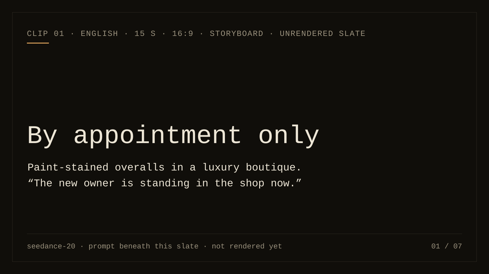
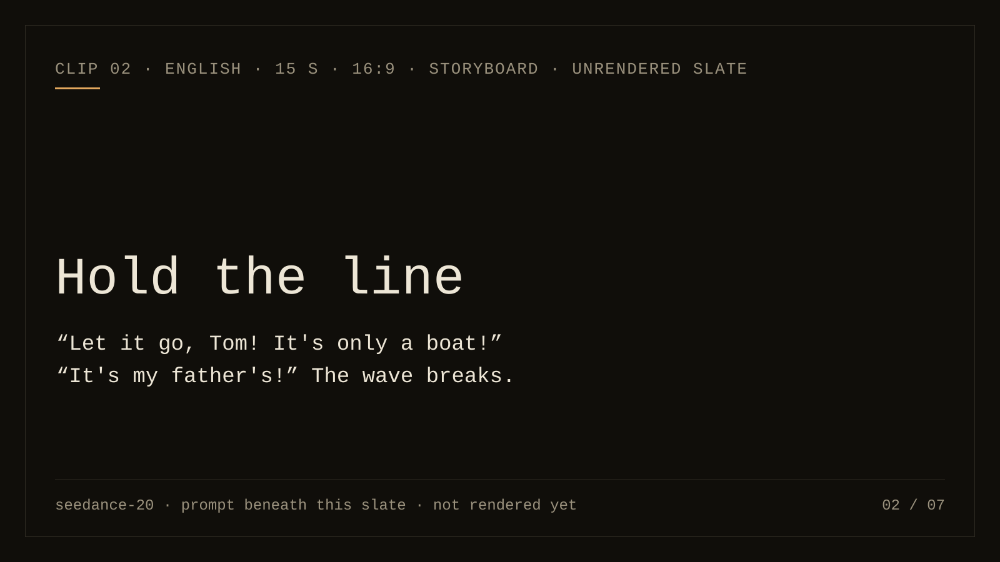
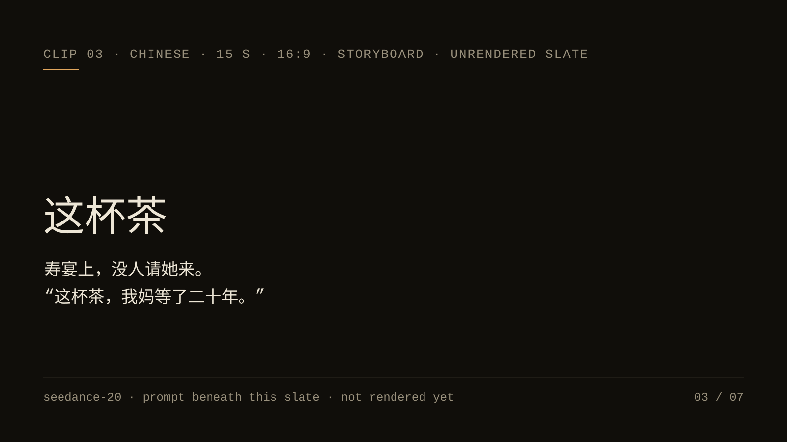
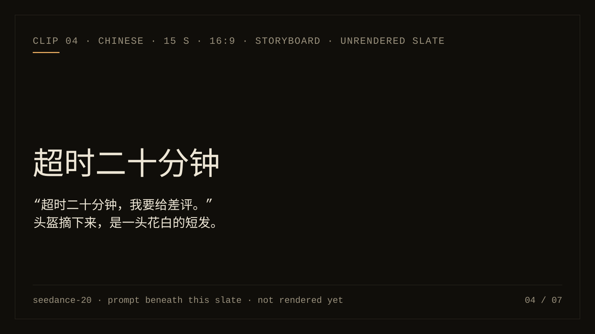
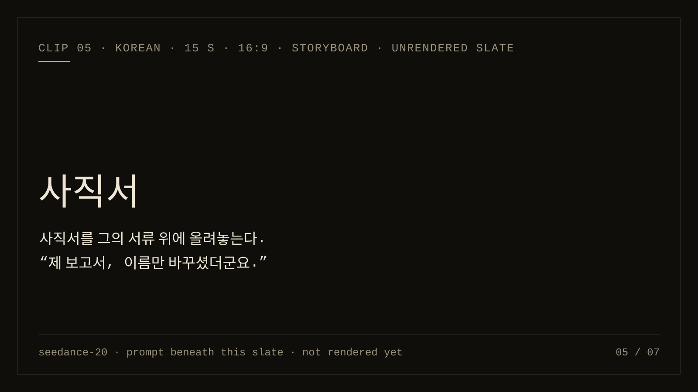
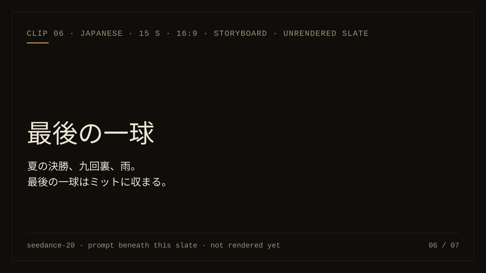
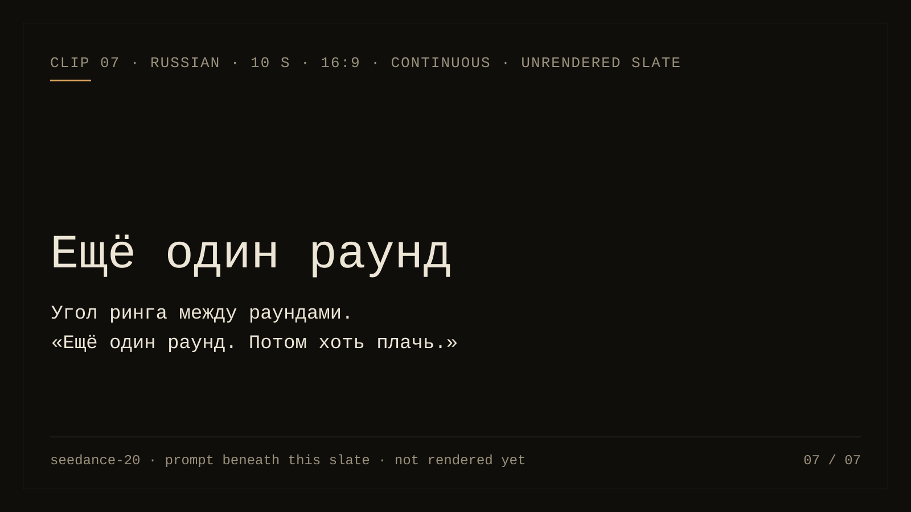

<picture>
  <source media="(prefers-color-scheme: dark)" srcset="assets/hero-dark.svg">
  <source media="(prefers-color-scheme: light)" srcset="assets/hero-light.svg">
  
</picture>

**Turn an idea into a directed video prompt.** Seedance 2.0 Skill OS is an agent
skill for planning shots, binding references and continuing from an accepted
clip. Your video provider handles generation and its costs.

[Watch the clips](#seen-not-told) · [Try a first prompt](#start-here) · [Install](#install) · [Choose a workflow](#choose-a-workflow) · [Evidence status](#evidence-status)

`v6.7.0` · [MIT](LICENSE) · [Changelog](CHANGELOG.md) · [Emily / Iamemily2050](https://github.com/Emily2040)

**Languages:** English (this page) · [中文](docs/README.zh.md) · [日本語](docs/README.ja.md) · [한국어](docs/README.ko.md) · [Español](docs/README.es.md) · [Русский](docs/README.ru.md)

Five-minute quickstarts: [English](docs/QUICKSTART.md) · [中文](docs/QUICKSTART.zh.md) · [日本語](docs/QUICKSTART.ja.md) · [한국어](docs/QUICKSTART.ko.md) · [Español](docs/QUICKSTART.es.md) · [Русский](docs/QUICKSTART.ru.md)

## Seen, not told

Seven scenes, seven prompts, five languages. Each is a complete fifteen-second story: the
situation legible by shot two, a reversal, and a hold on whoever lost, cut like short drama in
four or five shots. Each clip is generated on Seedance 2.0 from the exact prompt beneath it:
text to video, no reference assets, one take, no post work. Above each prompt sits the kind of
brief people usually type, so the difference is visible before it is explained. Every prompt
went through the [moderation pre-screen](references/moderation-prescreen.md) before publication,
because a classifier refuses words, not intent. Where a clip has not been rendered yet, its
slate stands in its place.

<table>
<tr>
<td width="50%" valign="top"><a href="#clip-01-by-appointment-only"></a></td>
<td width="50%" valign="top"><a href="#clip-02-hold-the-line"></a></td>
</tr>
<tr>
<td width="50%" valign="top"><a href="#clip-03-这杯茶"></a></td>
<td width="50%" valign="top"><a href="#clip-04-超时二十分钟"></a></td>
</tr>
<tr>
<td width="50%" valign="top"><a href="#clip-05-사직서"></a></td>
<td width="50%" valign="top"><a href="#clip-06-最後の一球"></a></td>
</tr>
<tr>
<td width="50%" valign="top"><a href="#clip-07-ещё-один-раунд"></a></td>
<td width="50%" valign="top"></td>
</tr>
</table>

#### Clip 01: By appointment only

<sub>English · 15 s · 16:9 · storyboard · slate: not rendered yet · ladder: Stretch: 4 beats, load 3, S = 2.1</sub>

**What people usually type:** *rich woman disguised as poor gets humiliated at luxury store, plot twist, satisfying, cinematic, 4k*

**What you know by shot two:** By the end of shot one the audience knows she is being refused because of how she is dressed; shot three tells them she owns the place.

<details>
<summary>The prompt the skill wrote</summary>

> Shot 1. Wide shot inside a hushed luxury boutique on a rainy afternoon: cream carpet, glass
> shelves of shoes, two assistants in black. A woman in paint-stained overalls and work boots
> pushes the door open, dripping, and the manager steps into her path before she has taken three
> steps, hands folded, a thin smile: "We're by appointment only, ma'am." Shot 2. Cut to a medium
> shot of her: she does not answer; she sits down on the white display chaise, crosses her muddy
> boots, and looks around the room like someone measuring it. Shot 3. Cut to a close shot of the
> manager as his phone buzzes; he answers, listens, and the smile goes: "Yes, sir. The new owner
> is... standing in the shop now." His eyes lift to her. Shot 4. Cut to a two-shot from behind
> her: she points at one pair of shoes on the wall without a word, and the manager hurries to
> fetch them. Hold on the wet bootprints across the cream carpet. Soft grey window light, warm
> spots on the shelves. Sound: rain on the glass door, her boots on the carpet, the phone's buzz,
> his voice dropping; no music, no subtitles.

</details>

#### Clip 02: Hold the line

<sub>English · 15 s · 16:9 · storyboard · slate: not rendered yet · ladder: Stretch: 4 beats, load 3, S = 2.1</sub>

**What people usually type:** *epic storm at sea, fisherman fights giant wave, slow motion, dramatic music, 8k*

**What you know by shot two:** Shot two tells the audience what the rope is worth: an off-screen voice says it is only a boat, and his answer says whose boat.

<details>
<summary>The prompt the skill wrote</summary>

> Shot 1. Wide shot of a wooden pier at night in a storm: a small fishing boat straining at a
> single mooring rope, its bow lifting and slamming with each swell, rain driven sideways through
> one sodium lamp, and behind the boat a wave building higher than the mast. Shot 2. Cut to a
> medium shot at deck height: a man in a soaked oilskin has both hands on the rope, boots braced
> against a cleat, the rope creaking as the boat pulls. From the dark behind the camera a voice
> shouts over the wind: "Let it go, Tom! It's only a boat!" Shot 3. Cut to a close shot of his
> face, rain running off his brow, eyes on the rope, and he shouts back without turning: "It's my
> father's!" Shot 4. Cut to a low angle: the wave breaks over the end of the pier and buries him
> in white water; when it drains away he is still standing, bent double, the rope still taut in
> his hands, the boat still there. Hold on the taut rope as the next swell lifts the bow. Orange
> sodium light and black water, nothing else. Sound: wind, the rope creaking, the two shouts, the
> wave's impact, water draining through the planks. No music, no subtitles.

</details>

#### Clip 03: 这杯茶

<sub>中文 · 15 s · 16:9 · storyboard · slate: not rendered yet · ladder: Stretch: 4 beats, load 3, S = 2.1</sub>

**What people usually type:** *豪门寿宴反转名场面，女主打脸全场，短剧爆点，电影感，高级感*

**What you know by shot two:** Shot one is a birthday banquet and a door opening on a woman nobody invited; shot two is the old man putting his cup down and turning away. The line in shot four says whose daughter she is.

<details>
<summary>The prompt the skill wrote</summary>

> 镜头1：固定全景，老宅厅堂里的寿宴，红色横幅下一张大圆桌坐满了人，主位的老爷子举起茶杯，全桌跟着举杯。厅堂的门被推开，一个穿旧呢子大衣、头发淋湿的女人站在门口，全桌的人回头看她。镜头2：镜头切至老爷子的近景，他举着的杯子停在半空，然后重重放下，把脸转开；他身边的中年男人半站起来，伸手要拦。镜头3：镜头切至女人的中景，她从最近的座位上端起一只满杯的茶，一步一步走到主位前，桌边的人纷纷把椅子往后挪；她把整杯茶慢慢倒在老爷子面前的白桌布上，茶水漫开、冒着热气，一直倒到杯子空了，再把空杯倒扣在湿桌布上。镜头4：镜头切至两人的中景，她看着他，平静地说：“这杯茶，我妈等了二十年。”说完转身走向门口，镜头不跟，留在老爷子那只放下了、再也没有端起来的杯子上。灯光只有头顶一盏暖黄的老式吊灯。声音：全桌举杯的碰响，门推开的一声，杯子重重放下的声音，椅子挪动，茶水落在布上，说话时全场无声；无配乐。保持无字幕。时长：15秒。

</details>

#### Clip 04: 超时二十分钟

<sub>中文 · 15 s · 16:9 · storyboard · slate: not rendered yet · ladder: Stretch at the boundary: 4 beats, load 4, S = 1.9</sub>

**What people usually type:** *外卖员被差评感人反转，正能量短剧，泪目，电影感*

**What you know by shot two:** Shot one is a soaked delivery rider at a door and a man with his phone out; shot two is the threat of a bad review. Shot three shows who is under the helmet.

<details>
<summary>The prompt the skill wrote</summary>

> 镜头1：固定中景，深夜住宅楼的走廊，雨声很大。一个穿黄色雨衣、戴着头盔的外卖员浑身滴水地站在门口，双手捧着一袋外卖。门开了，一个穿睡衣、握着手机的中年男人堵在门里，脸色难看。镜头2：镜头切至男人的近景，他把手机屏幕转向对方，说：“超时二十分钟，我要给差评。”镜头3：镜头切至外卖员的近景，她摘下头盔：花白的短发，六十岁上下，雨水顺着脸往下流。她把外卖递过去，低声说：“对不起，钱我退给您。”镜头4：镜头切至男人的近景，他按向屏幕的手指停住了，目光落到她湿透的鞋上；他没有接外卖，而是侧身让开门口，把门拉得更开。画面停在敞开的门和门口那一小滩雨水上。灯光只有走廊的白炽灯和门里透出的暖光。声音：雨声，头盔卡扣打开的声音，塑料袋的窸窣声，说话时其他声音压低；无配乐，保持无字幕。时长：15秒。

</details>

#### Clip 05: 사직서

<sub>한국어 · 15 s · 16:9 · storyboard · slate: not rendered yet · ladder: Stretch: 3.5 beats (two inserts at half), load 4, S = 2.0</sub>

**What people usually type:** *사이다 사직서 장면, 직장인 드라마, 시네마틱, 4K, 감동*

**What you know by shot two:** Shot one is a CEO signing at night and an employee walking in; shot two is her envelope landing on the page he is signing. Her line says he stole her report and was promoted for it.

<details>
<summary>The prompt the skill wrote</summary>

> 샷 1: 밤의 유리벽 임원실, 넓은 책상 뒤에서 대표(오십 대 남성, 셔츠 소매를 걷음)가 서류에 서명하고 있고, 고개를 들지 않는다. 젊은 직원(이십 대 후반 여성, 회색 정장, 사원증을 목에 걸음)이 문을 열고 들어와 책상 앞까지 걸어온다. 샷 2: 책상 위 클로즈업, 그녀의 손이 흰 봉투 하나를 그가 서명하던 서류 바로 위에 올려놓는다. 펜이 멈춘다. 샷 3: 그녀의 미디엄 숏, 물러서지 않고 그를 내려다보며 말한다. 직원: “제 보고서, 이름만 바꾸셨더군요. 승진 축하드려요.” 샷 4: 대표의 클로즈업, 펜을 쥔 손이 굳고, 그제야 천천히 고개를 든다. 이미 그녀는 등을 돌려 문으로 걸어가고 있다. 샷 5: 유리문이 닫히고, 카메라는 유리에 비친 그의 얼굴에서 멈춘다. 조명은 책상 스탠드 하나와 창밖 도시의 불빛뿐. 소리: 펜 소리가 멈추는 순간, 봉투가 종이 위에 놓이는 소리, 구두 소리, 문이 닫히는 소리. 대사 중에는 다른 소리를 낮춘다. 음악 없음, 자막 없음.

</details>

#### Clip 06: 最後の一球

<sub>日本語 · 15 s · 16:9 · storyboard · slate: not rendered yet · ladder: Stretch: 4 beats (two at half), load 3, S = 2.1</sub>

**What people usually type:** *高校野球決勝ラストボール神作画、感動、エモい、有名アニメスタジオ風、4K*

**What you know by shot two:** Shot one is a pitcher on the mound in the rain with the crowd behind him; the sign, the wind-up and the swing say final pitch without a caption.

<details>
<summary>The prompt the skill wrote</summary>

> 手描きの2Dセルアニメーション。セル画のキャラクターを、水彩で描かれた背景画の上に置く。作画の密度が高く、限られた色数、フィルムの粒子が乗った質感。夏の決勝戦の九回裏、雨が降り始めた球場。
> ショット1：マウンドの投手（泥だらけのユニフォーム、帽子のつばから雨が落ちる）を正面から捉えたミディアムショット。肩で息をしている。背景の観客席は塗りの中でざわめきの色だけが動く。
> ショット2：カットして捕手のミットのクローズアップ。指がサインを出し、ミットが低く構えられる。
> ショット3：カットして投手のワインドアップ。振りかぶりからリリースまでを一コマ打ちのフルアニメーションで描き、腕の軌道は一枚のスミア、雨粒が腕の動きに引かれて流れる。
> ショット4：カットして打者の空振り。バットが空を切った瞬間、ボールがミットに収まる音と同時に画面全体を白黒反転のインパクトフレームにする。
> ショット5：カットして止め絵。投手がマウンドで膝をつき、帽子を取って空を見上げる。雨だけが動いている。その前後は二コマ打ち。カメラは背景画に対して固定。光は曇天の平坦な光と、濡れた土の反射。音：雨音、観客のざわめき、ミットの乾いた一音、そのあとは雨音と投手の息だけ。音楽なし、字幕なし。

</details>

#### Clip 07: Ещё один раунд

<sub>Русский · 15 s · 16:9 · storyboard · slate: not rendered yet · ladder: Stretch at the boundary: 4 beats (two at half), load 4, S = 1.9</sub>

**What people usually type:** *тренер и боксёр перед решающим раундом, драма, кинематографично, эпично, 4k*

**What you know by shot two:** Shot one is a corner between rounds and a fighter who has stopped looking up; shot two is the trainer's line, and shot three shows who is watching from the stands.

<details>
<summary>The prompt the skill wrote</summary>

> Кадр 1. Статичный средний план на уровне канатов: угол ринга между раундами, ночной боксёрский
> зал, единственный свет — лампа над рингом. Боксёр (лет двадцать пять, опухшая бровь, капа во
> рту) сидит на табурете, тяжело дышит и смотрит в пол. Тренер (за шестьдесят, полотенце на плече,
> седая щетина) прижимает к его брови лёд, завёрнутый в полотенце. Кадр 2. Крупный план тренера,
> он говорит ровно, не повышая голоса: «Хочешь бросить — бросай. Только мать смотрит.» Кадр 3.
> Кадр с трибун: среди сидящих зрителей стоит одна маленькая пожилая женщина в пальто, накинутом
> на плечи, руки сцеплены у груди. Кадр 4. Крупный план боксёра: он поднимает глаза в сторону
> трибун и один раз кивает. Кадр 5. Гонг. Он встаёт и выходит из кадра, а камера остаётся на
> пустом табурете с брошенным полотенцем. Звук: тяжёлое дыхание, шум зала за кадром, звон гонга в
> конце; во время реплики остальные звуки тише. Без музыки, без субтитров.

</details>

How the clips are made, the settings, the internal read behind each prompt and the render record are in the [front-page clip brief](https://github.com/Emily2040/seedance-2.0/blob/main/docs/FRONT_PAGE_CLIPS.md). A rendered clip proves that one take; it is not a promise about the next one.

## Start Here

After installation, tell your agent what happens and what must stay fixed:

> Use seedance-20. A person finishes a paper fan at a workbench. Keep it quiet,
> with one static shot and no music. Give me the prompt only.

One possible draft:

```text
Locked tabletop shot. Two hands
finish the last fold of a paper
fan and let go. The fan settles
on the wood. Hold still for one
beat. Warm desk-lamp light;
dry paper rustle and room tone.
No music.
```

**Why these choices:** one visible action, a clear endpoint, a fixed camera and
an explicit sound choice. Duration and aspect ratio belong in your provider's
controls when that surface owns them. This is an unrendered teaching example;
it does not establish successful folding, motion or audio generation.

For another treatment, choose calm observation, a playful gag or a step-by-step
demonstration. Tell the agent which one you want to keep. A draft can be revised
without submitting a paid generation request.

<!-- teaching-image:placement -->
<!-- installed-readme-gallery:start -->


*AI-generated teaching concept, not Seedance output.* The still illustrates
material, framing and light; it does not prove the action or sound will render.
[Image provenance and prompts](docs/PAPER_FAN_ART.md).

<!-- installed-readme-gallery:end -->

More examples: [performance and dialogue](references/performance-example-cards.md),
[product and process](references/product-example-cards.md),
[reference and continuity](references/continuity-example-cards.md).

## Choose a workflow

| What you have | What to provide next |
|---|---|
| A rough idea | The action, feeling and delivery format; ask for a few distinct choices. |
| A prompt to improve | The draft and constraints you want preserved. |
| Image, video or audio references | Actual files and the role each should control. |
| An accepted clip to continue | Its observed ending and the next action. |
| A result that missed | The failed requirement and your remaining revision budget. |

Start with the [quickstart](docs/QUICKSTART.md),
[reference workflow](references/reference-workflow.md),
[continuation guide](skills/seedance-continuation/SKILL.md) or
[retake protocol](references/retake-protocol.md).

## Install

Get a local copy, then run the installer from that folder. This example selects
Codex user scope; other clients are in the table below.

```bash
git clone https://github.com/Emily2040/seedance-2.0.git
cd seedance-2.0
python scripts/install_codex_skill.py --client codex --scope user
```

Download ZIP also works: extract it and run the installer inside that folder.
Restart your client, then select `seedance-20`. Review the
[security policy](SECURITY.md) before configuring optional provider tools.
Prompt preparation does not authorize paid generation.

Treat the table below as common local targets to verify in your own client, not a universal support guarantee.

| Platform | Typical install target (verify in your client) |
|---|---|
| Claude Code | `~/.claude/skills/seedance-20/` (personal) or `.claude/skills/seedance-20/` (project) — both via `scripts/install_codex_skill.py --dest` |
| Codex | project `.agents/skills/seedance-20/` or user `~/.agents/skills/seedance-20/`; no-option installer keeps its historical path |
| Google Antigravity | `.agents/skills/seedance-20/` (workspace) or `~/.gemini/config/skills/seedance-20/` (global across Antigravity products) |
| OpenClaw | workspace `skills/seedance-20/` or `~/.openclaw/skills/seedance-20/` via `openclaw skills install` (ClawHub-compatible; skills already carry `openclaw:` metadata) |
| Hermes Agent | `~/.hermes/skills/seedance-20/` (primary); a project `skills/seedance-20/` directory is discovered only after its parent is added to `skills.external_dirs` in `~/.hermes/config.yaml` |
| Gemini CLI-style workspace | `.gemini/skills/seedance-20/` |
| GitHub Copilot workspace | `.github/skills/seedance-20/` |
| Cursor workspace | `.cursor/skills/seedance-20/` |
| Windsurf workspace | `.windsurf/skills/seedance-20/` |
| Trae (ByteDance) | `.trae/skills/seedance-20/` |
| Qwen Code (Alibaba) | `.qwen/skills/seedance-20/` or `~/.qwen/skills/seedance-20/` |
| OpenCode | `.opencode/skills/seedance-20/` (also reads `.claude/skills/` and `.agents/skills/`) |
| Amp (Sourcegraph) | `.agents/skills/seedance-20/` or `~/.config/agents/skills/seedance-20/` |
| Goose (Block) | `.agents/skills/seedance-20/` (also `.goose/skills/seedance-20/`) |
| Junie (JetBrains) | `.junie/skills/seedance-20/` or `~/.junie/skills/seedance-20/` |

Several of these clients share the `.agents/skills/` convention — Codex, Google Antigravity, OpenCode, Amp, and Goose all read it — so one install under `.agents/skills/seedance-20/` can serve them together, and `.claude/skills/` is read by many as a compatibility path. Install once as the `seedance-20` root skill; its sub-skills and references resolve by relative path.

<details>
<summary>Installation by client, replacement and recovery details</summary>

Client support for Agent Skills is still tool-specific. See [observed compatibility and the host smoke protocol](https://github.com/Emily2040/seedance-2.0/blob/main/docs/HOST_COMPATIBILITY.md) for tested revisions and explicit gaps. Codex documents a skill as a directory with a required `SKILL.md`, optional `scripts/`, `references/`, `assets/`, and optional `agents/` metadata.

Codex scans `.agents/skills` locations from the working directory upward, plus user/admin/system skill locations. A repository root with `SKILL.md` is shaped like a skill folder, but it still needs to be installed/copied under a scanned skills directory or distributed as a plugin for automatic discovery.

### Step 1 — get the files

Every install path below runs from inside a local copy of this repository, so start here:

```bash
git clone https://github.com/Emily2040/seedance-2.0.git
cd seedance-2.0
```

Without `git` installed, use the green **Code → Download ZIP** button on the repository page, unzip it, and change into the unzipped folder instead. Nothing else on this page works until one of those two has happened.

### Step 2 — install it into your client

The installer is not Codex-only. Choose a client and scope below, or point `--dest` at another client's documented skills parent directory:

```bash
# Codex — user scope at ~/.agents/skills
python scripts/install_codex_skill.py --client codex --scope user

# Claude Code — personal install at ~/.claude/skills
python scripts/install_codex_skill.py --client claude-code --scope user

# One existing project, outside this source checkout
python scripts/install_codex_skill.py --client codex --scope project --project-root /path/to/project

# Any other client — use its documented skills parent directory
python scripts/install_codex_skill.py --dest /path/to/client/skills
```

Choose either `--dest` or `--client` with `--scope`; project scope requires an
existing `--project-root` and never guesses from your current directory. The
[scope guide](https://github.com/Emily2040/seedance-2.0/blob/main/docs/INSTALL_SCOPES.md)
explains the paths. No-option commands preserve the historical
`$CODEX_HOME/skills` or `~/.codex/skills` default for existing workflows; they do
not migrate old copies. Use the same destination options with the read-only
`install_doctor.py` before deciding on replacement.

The command stages and validates the repository before promoting it to
`<dest>/seedance-20`, then prints where it landed. Concurrent installers
sharing that destination are serialized. Add `--force` only to replace a
complete existing install; the previous copy remains available for rollback
until the validated stage is promoted. The durability, recovery and same-account
trust boundaries of that transaction are documented in
[installer internals](https://github.com/Emily2040/seedance-2.0/blob/main/docs/INSTALL_INTERNALS.md).
Restart your client afterwards so `seedance-20` appears in its skill list.

Installs skip the quarantined `references/migrated/` history, the image gallery (about 18 MB of PNGs), the test suite, and the network-capable evaluator. The installer replaces the omitted gallery embeds with one repository link, so the installed README does not contain broken local asset targets.

A destination inside this repository is refused rather than attempted because it would mutate the source authority domain while the payload is being authenticated. For a project-local install, run the script from the project you are installing into, by absolute path, as above.

For a client that imports a local skill folder, first prepare the filtered payload in a new staging directory outside this checkout:

```bash
python scripts/install_codex_skill.py --dest /absolute/path/to/new-staging/skills
```

Import the resulting `skills/seedance-20/` folder, or run the installer with
`--dest` set directly to the skills parent directory your client scans. Keep the
directory name `seedance-20` and its relative layout. A raw repository clone or
a client-managed GitHub import may include the evaluator, provider helpers, tests
and archives; it does not carry the installer's filtered-payload guarantee.
Inspect how that client packages files before using a direct import. See
[manual transfer and verification](https://github.com/Emily2040/seedance-2.0/blob/main/docs/MANUAL_INSTALL.md).

</details>

## Evidence status

- Repository checks cover routing, state, packaging, source integrity and
  declared document structure. Passing them is not a rendered-quality verdict.
- Live model scores and rendered-pilot results remain pending. The
  [comparison protocol](https://github.com/Emily2040/seedance-2.0/blob/main/references/outcome-comparison.md)
  and [48-attempt pilot plan](https://github.com/Emily2040/seedance-2.0/blob/main/evals/capped-rendered-pilot.md)
  describe how to collect evidence without inventing results.
- Six languages have full pages, quickstarts and vocabulary. Independent
  review is pending for all of them, and the
  [coverage contract](docs/LANGUAGE_COVERAGE.md) currently flags every
  language for review after recent edits. Availability is not parity.
- Provider capabilities are surface-specific and dated. Check the
  [surface matrix](references/platform-surface-matrix.md) before choosing controls.

## What it routes

Describe the situation; the root skill loads what that situation needs.

<details>
<summary>The common cases, and what each returns</summary>

| You say | It loads | You get |
|---|---|---|
| “I have a vague idea.” | [`seedance-interview-short`](skills/seedance-interview-short/SKILL.md) | A brief and a first draft, or one blocking question. |
| “I know the scene I want.” | [`seedance-prompt`](skills/seedance-prompt/SKILL.md) | A production-ready prompt. |
| “Make it short and strong.” | [`seedance-prompt-short`](skills/seedance-prompt-short/SKILL.md) | A compressed 30–100 word prompt. |
| “This is a longer story.” | [`seedance-sequence`](skills/seedance-sequence/SKILL.md) | Story spine, continuity bible, sequence map, and the Clip 01 contract and prompt. |
| “Continue this video.” | [`seedance-continuation`](skills/seedance-continuation/SKILL.md) | A continuation from accepted footage, or a request for the missing clip or final frame. |
| “I have image, video or audio references.” | [`reference-workflow`](references/reference-workflow.md) | A role map for every asset and what each must not transfer. |
| “Use this as first frame and that as last.” | [`first-last-frame-guide`](references/first-last-frame-guide.md) | A continuous transition with endpoint locks. |
| “Make it feel directed, not just cinematic.” | [`directing-engine`](references/directing-engine.md) | One intention per scene and a coherent camera, light, blocking, performance and sound setup. |
| “The take is 80% right.” | [`retake-protocol`](references/retake-protocol.md) | A triage verdict, a one-variable retake, and an attempt budget. |
| “It failed or looks bad.” | [`seedance-troubleshoot`](skills/seedance-troubleshoot/SKILL.md) | A root-cause diagnosis and a repaired prompt. |
| “This uses a character, brand or real person.” | [`seedance-copyright`](skills/seedance-copyright/SKILL.md) | A safer rewrite that keeps the creative function. |
| “I need this for a client, campaign or delivery.” | [`pro-filmmaking-standards`](references/pro-filmmaking-standards.md) | The production object the role needs, then the prompt that fits inside it. |
| “API, pricing, model ID, provider?” | [`api-workflow`](references/api-workflow.md) | A source-gated operational checklist. |

</details>


The diagram is the contract: every request passes the gates, the root routes it,
and the validators hold the line. The complete map of 28 sub-skills and every
reference is in the [reference index](https://github.com/Emily2040/seedance-2.0/blob/main/docs/REFERENCE_INDEX.md);
the runtime authority is the load map in [`SKILL.md`](SKILL.md).

## Longer than one generation

Do not ask the skill to extend the original prompt. A continuation is based on
accepted generated footage, because Seedance may not end where the plan expected.

1. Describe the complete idea and how it ends.
2. The skill divides it into connected clips.
3. Generate Clip 01.
4. Return the generated clip or its final frame.
5. The skill records what actually happened.
6. It writes Clip 02 from the real ending.
7. Repeat until the planned final outcome is reached.

The project state is the source of truth, the clip contract is the current task,
and the prompt is compiled for that task only.

## Model line and platform facts

**This is a Seedance 2.0 skill.** ByteDance's
[official Seedance 2.5 model page](https://seed.bytedance.com/en/seedance2_5)
confirms a separate newer line, and
[Dreamina's official product page](https://dreamina.capcut.com/seedance/seedance-2-5)
says it is live on Dreamina.
Neither primary page gives an exact launch date, and API or other-surface availability was unconfirmed in the 2026-08-01 review.
The 2026-09-07 source review adds that Runway's API catalog now lists
`seedance2_5` separately, which does not establish account entitlement. Every
platform number in this repository is a 2.0 number. Establish which line a
surface runs before quoting one.

Before any factual claim about API availability, upload limits, pricing,
regions or model names, load [`api-status.md`](references/api-status.md) and
check its `last_verified` date. Treat every endpoint, model ID, price,
account requirement, face or reference policy, and output-rights claim as
provider-specific and recheck it live before implementation.

## Validation

<!-- installed-readme-validation:start -->

The validation toolchain supports **CPython 3.11 through 3.13**. CI exercises
both endpoints on Ubuntu and Windows; intermediate CPython 3.12 releases remain
inside the supported range. Python 3.10 and 3.14 are outside this lock's
supported range.

Install the two hash-pinned toolchains once, then run the release suite. The
offline source-metadata check runs with `--enforce-freshness` here so an old
checked-in registry stamp blocks a release; per-pull-request CI omits that flag
because metadata age depends on the calendar, not on the change under test.

```bash
python -m pip install --require-hashes --requirement requirements-validation.lock
python -I -S -B scripts/build_masthead_outlines.py --install-build-deps
```

```bash
python -I -S -B scripts/build_masthead_outlines.py --check
python scripts/validate_repo.py --release
```

`validate_repo.py` resolves the repository from its own file location and does
not call Git, so this also works from a Download ZIP extraction, from a nested
caller directory, and from a path containing spaces.
`python -I -S -B scripts/build_hero.py --check` proves the committed masthead
SVGs still match their generator; it runs in CI. What each check proves, and
what it cannot, is in the
[validation guide](https://github.com/Emily2040/seedance-2.0/blob/main/docs/VALIDATION.md).
Schema checks are not lineage proofs. The source-registry check does not fetch URLs
and does not prove that any upstream claim is still true. The architecture stress
gate is a structural gate, not a creativity judge.

### Git checkout-only hygiene

After the archive-safe checks, a maintainer working in a Git checkout should
also run:

```bash
git diff --check
```

This whitespace check requires Git metadata. Do not run it in a Download ZIP
extraction.

### Checked-in source metadata age

Whether `references/source-registry.md` is stale depends on today's date, not
on the change being tested, so it is not asked per pull request. The release
checklist asks it with `--enforce-freshness`, which blocks a release when the
checked-in stamp is older than 30 days, and `source-freshness-review.yml` asks
it every Monday on the default branch, keeping one tracking issue open while the
registry drifts. The job never edits the registry: re-stamping `last_verified`
without re-reading the sources would record a verification that never happened.

Model-in-the-loop evaluation lives outside offline CI. `python scripts/eval_run.py --limit 1`
prints an offline plan without network, credential read or ledger write. A live
run needs `--live`, an explicit `--max-calls` ceiling and a provider key from the
environment, and only a complete run may replace
[`evals/eval-run-ledger.md`](evals/eval-run-ledger.md). The validation guide
documents the frozen source manifest, blind discovery scoring and ledger
publication rules.

<!-- installed-readme-validation:end -->

## Design Standard

The front page follows an editorial design system rather than default AI
styling: warm ink and paper themes, an outlined serif wordmark with monospace
specification labels, a single amber accent and hairline rules. No gradients,
no glow, no badges, and no camera costume: no viewfinder marks, timecode,
record dots or aspect badges. Tokens and rules live in the
[frontend design system](references/frontend-design-system.md); the manual
acceptance pass is in [README design acceptance](docs/frontend-redesign.md).

The masthead pair is generated from one geometry by
[`scripts/build_hero.py`](scripts/build_hero.py), so the dark and light
variants cannot drift apart, and `python -I -S -B scripts/build_hero.py --check`
proves the committed SVGs still match the generator. The outlined display type
has its own sealed build toolchain: run
`python -I -S -B scripts/build_masthead_outlines.py --install-build-deps` once,
then `--check`; the full trust chain is in the
[masthead build guide](https://github.com/Emily2040/seedance-2.0/blob/main/docs/MASTHEAD_BUILD.md).

The clip gallery follows one rule: a clip on this page is Seedance 2.0 output
rendered from the prompt printed beneath it, captioned with surface, date and
settings, or its slate says it is not rendered yet. Slates are generated from
`data/front-page-clips.json` by `scripts/build_clip_posters.py`, whose
`--check` keeps them in step with the data.

The masthead is served through a `prefers-color-scheme` picture element; the
operating diagram `assets/skill-map.svg` carries its own background so it reads
on both themes. The page must stay readable on GitHub mobile, in dark mode and
at narrow widths. SVG assets carry `<title>` and `<desc>`, use internal CSS
only, and load no external fonts, scripts or resources.

## Changelog

See [CHANGELOG.md](CHANGELOG.md) for release history and [open issues](https://github.com/Emily2040/seedance-2.0/issues) to contribute.

## License

[MIT](LICENSE). Maintained by [Emily / Iamemily2050](https://github.com/Emily2040).
